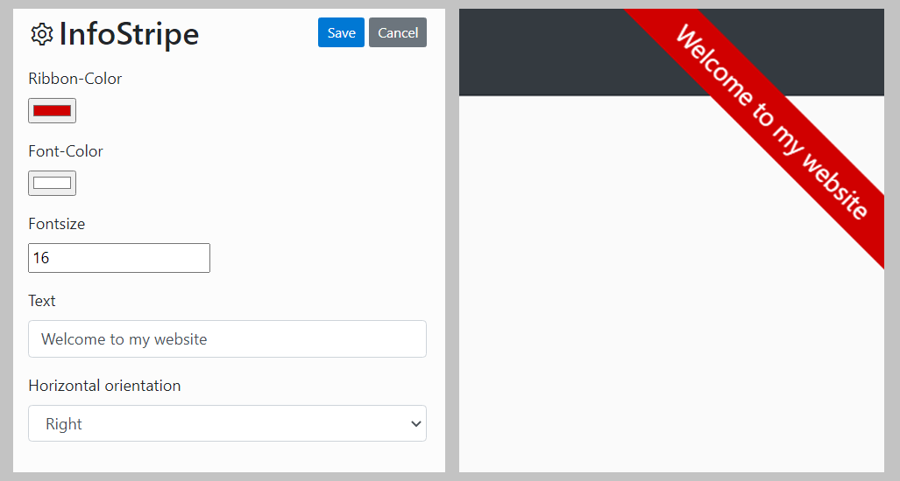

  <h1>InfoStripe</h1>
  A Bludit plugin built with ❤️ by <a href="https://github.com/TheBuzzDee">TheBuzzDee</a>

---

InfoStripe
========

InfoStripe is a plugin for Bludit that adds a fully responsive CSS-Ribbon in a corner of your site.

Settings
========

| Setting | Description | Example |
|-|-|-|
| Ribbon-Color | Color of the ribbon. Choose with color-picker | `#D00000` |
| Font-Color | Color of the Font. Choose with color-picker | `#FFFFFF` |
| Font-Size | Set the size of your font. | `16` |
| Text | Text which is shown on your ribbon | `Welcome to my website` |
| Horizontal orientation | Choose if your ribbon is displayed on the left or right upper corner of your website. | `Left` or `Right`  |

License
========

MIT License

Copyright (c) 2021 TheBuzzDee

Permission is hereby granted, free of charge, to any person obtaining a copy
of this software and associated documentation files (the "Software"), to deal
in the Software without restriction, including without limitation the rights
to use, copy, modify, merge, publish, distribute, sublicense, and/or sell
copies of the Software, and to permit persons to whom the Software is
furnished to do so, subject to the following conditions:

The above copyright notice and this permission notice shall be included in all
copies or substantial portions of the Software.

THE SOFTWARE IS PROVIDED "AS IS", WITHOUT WARRANTY OF ANY KIND, EXPRESS OR
IMPLIED, INCLUDING BUT NOT LIMITED TO THE WARRANTIES OF MERCHANTABILITY,
FITNESS FOR A PARTICULAR PURPOSE AND NONINFRINGEMENT. IN NO EVENT SHALL THE
AUTHORS OR COPYRIGHT HOLDERS BE LIABLE FOR ANY CLAIM, DAMAGES OR OTHER
LIABILITY, WHETHER IN AN ACTION OF CONTRACT, TORT OR OTHERWISE, ARISING FROM,
OUT OF OR IN CONNECTION WITH THE SOFTWARE OR THE USE OR OTHER DEALINGS IN THE
SOFTWARE.